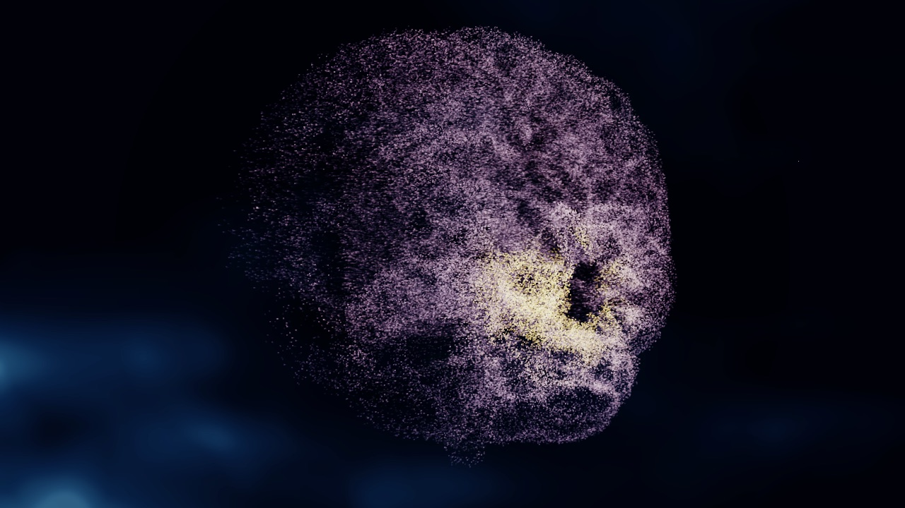
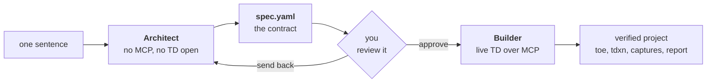
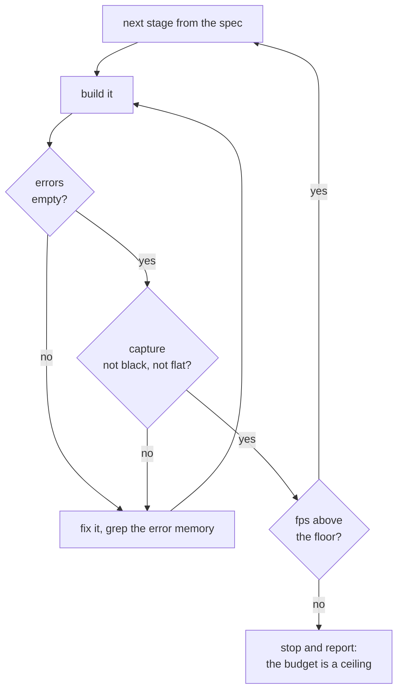

# TouchDesigner Factory Harness

A contract-first agent harness for TouchDesigner. You write a sentence, an agent writes a
contract, you approve it, and a second agent builds and verifies the project against it.

| | | |
|---|---|---|
|  |  |  |

*Three outputs built through the harness, from the two contracts in `projects/`.*

## Why

Hand an agent a TouchDesigner project and no contract, and it improvises. It piles up
operators, declares victory on a black frame, and forty turns later you have a network
nobody can read and nothing has checked.

The harness puts a written artifact in the middle, and a human at the gate.



A wrong spec costs you a 60-line review. A wrong build costs forty minutes. The split moves
the cost of being wrong to the cheap side.

## Three things it enforces

**A contract, before anything gets built.** `spec.yaml` pins resolution, target fps, inputs
and their mocks, the pipeline stages, exposed parameters with mandatory help text, operator
and GPU budgets, acceptance criteria, and risks with fallbacks. `validate_spec.py` refuses
placeholders, incoherent stage graphs, budgets that do not add up, and criteria no tool call
can check — "looks good" is rejected by design.

**Gates, not vibes.** Every stage is verified before the next one starts, and the Builder
measures rather than eyeballs.



**Memory.** Two registries the agents read before building and write afterwards: `lib/` for
components that worked, `knowledge/lessons.yaml` for errors whose cause was found and whose
fix was verified. Both ship empty — they are your project's memory, not someone else's. A
starter pack of TouchDesigner gotchas sits in `knowledge/lessons.field-tested.yaml`, to
adopt or delete.

## Quick start

Requirements: TouchDesigner 2025.33070+, Python 3.11+ with PyYAML, and an MCP client
(Claude Code, Codex, Cursor, opencode, …).

```bash
git clone <this-repo> && cd touchdesigner-factory-harness
pip install pyyaml
```

Install [Embody](https://github.com/dylanroscover/Embody) into a blank TouchDesigner project
and save it as `templates/seed.toe` — `templates/SEED-SETUP.md` walks the five steps, once,
in about five minutes. Then:

```bash
python scripts/check_env.py     # want: SEED READY
```

Now describe what you want:

```
/new-td-project a particle cloud that reacts to an audio signal
```

The Architect asks at most three questions, writes the contract, validates it, and stops.
You read 60 lines of YAML. If it is right:

```
/build-td-project my-slug
```

The Builder measures a baseline, builds stage by stage with a capture after each, walks the
acceptance criteria, externalizes the code, exports a diffable network, and writes its
report.

## What a project looks like afterwards

```
projects/<slug>/
├── spec.yaml          the contract, source of truth for intent
├── network/*.tdxn     the network as readable YAML, source of truth for structure
├── glsl/, scripts/    externalized shaders and code, diffable
├── captures/          timestamped visual evidence, one per pass
├── build-report.md    what was built, measured, and where it deviated
└── project.toe        binary, regenerable from everything above
```

The `.toe` is the artifact; the rest is what makes it reviewable.

## Two worked examples

| Project | What it shows |
|---|---|
| [`brain-eeg-cloud`](projects/brain-eeg-cloud) | driven by an external signal, with an asset to load, mouse interaction and a control panel |
| [`nebula-morph`](projects/nebula-morph) | the opposite case: no input at all, the piece drives itself from time |

Each ships its contract, its network, its shaders, its build report and its captures. Read a
`spec.yaml` before writing your own — it is faster than reading the schema.

## Any agent, not just Claude

`AGENTS.md` is the canonical entry point: same roles, same rules, same files, whatever your
harness. Envoy is a standard MCP server, so any MCP client can drive it, and both registries
are plain YAML that every agent reads and writes.

## Credits

Built on [Embody and Envoy](https://github.com/dylanroscover/Embody) by Dylan Roscover
(MIT): version-controlled externalization of TouchDesigner operators, and the MCP server
that makes a live session addressable. This repo would not exist without them.

MIT licensed — see `LICENSE`.
