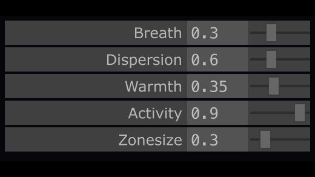

# TD Factory

One sentence in, a working TouchDesigner project out. Two agent roles, a written contract
between them, and a memory that grows with every mistake.


*Example project `brain-eeg-cloud`: 215,601 surface points, an activity focus driven by a
simulated EEG signal, 60 fps. The contract that produced it is 120 lines of YAML.*

## The problem

An agent building TouchDesigner without a contract improvises. It piles up operators, and
forty turns later you have a network nobody can read, that nobody can check against what you
asked for, and that nothing has verified.

TD Factory splits the work in two and puts a written artifact in the middle.

```
        one sentence
             |
             v
     [ Architect ]  --->  projects/<slug>/spec.yaml
             |                      |
     no MCP,                 you review it. This is the only
     no TD open              moment you really have to think.
                                    |
                                    v
                             [ Builder ]  --->  live TD session over Envoy MCP
                                    |                        |
                                    v                        v
                            build-report.md         .toe + .tdxn + captures
```

Splitting moves the cost of a mistake from the build to the review. A wrong spec is fixed in
thirty seconds; a wrong build is forty minutes in the bin.

## What it actually produces

The example project started from this sentence:

> a point-cloud brain that comes alive with an EEG signal, dark but animated background

The Architect asked four questions (signal source, look, background, delivery context), wrote
the contract, and stopped. The Builder built six stages, measured a baseline, captured after
each stage, swept the sixteen exposed parameters and wrote its report.

| First delivery | After human feedback |
|---|---|
|  |  |

Each stage's parameters are exposed in a native panel fed directly from the components'
Custom pages: adding a parameter makes it appear without touching the panel.



## Install

Requirements: **TouchDesigner 2025.33070+**, **Python 3.11+** with PyYAML, and an MCP client
(Claude Code, Codex, Cursor, opencode, ...).

```bash
git clone <this-repo> td-factory && cd td-factory
pip install pyyaml
```

Then follow `templates/SEED-SETUP.md`: install [Embody](https://github.com/dylanroscover/Embody)
into a blank TouchDesigner project, run the Setup Wizard, save the result as
`templates/seed.toe`. Five minutes, once. Every new project starts from that seed with Embody
and Envoy already inside.

```bash
python scripts/check_env.py     # must print SEED READY
```

## Use

```
/new-td-project a point-cloud brain reacting to an EEG signal
```

The Architect scaffolds the folder, reads the library, asks at most three questions, writes
`projects/<slug>/spec.yaml`, validates it, and stops so you can review.

```
/build-td-project brain-eeg-cloud
```

The Builder launches TD, measures a performance baseline, builds stage by stage with a
capture after each one, walks the acceptance criteria, externalizes the code, exports the
TDXN and writes its report.

Both roles may run in **the same session** — that is cheaper in context. What is never
skipped is the gate between them.

## The gate

```bash
python scripts/validate_spec.py <slug>
```

It rejects a spec with leftover placeholders, an inconsistent stage graph, budgets that do
not add up, a parameter without help text, fewer than three acceptance criteria, a criterion
no tool call can check ("looks good"), or an empty risks section. Exit 0 means the build is
allowed.

Plus an explicit human approval. Silence is not approval, and an agent never approves its own
spec — that is the entire reason the two roles exist separately.

## The file that matters

`projects/<slug>/spec.yaml`. Everything else is plumbing. It pins the decisions that are
expensive to change later:

- `output`: mode, resolution, target fps and tolerance
- `inputs`: every input with its mock, so the build never depends on hardware
- `pipeline`: three to six stages, one responsibility each, an acyclic graph
- `params`: what is exposed, with range, default and mandatory help text
- `budget`: operator and GPU cook ceilings, not suggestions
- `acceptance`: at least three criteria, every one checkable by a tool call
- `risks`: never empty, each with its fallback

`projects/brain-eeg-cloud/spec.yaml` is a complete, valid example — read it before writing
one.

## The four verification gates

No build is finished without: a capture with a `pass` quality verdict (neither black nor
flat), `get_op_errors` empty across the whole hierarchy, fps above the floor with every input
active, and every parameter swept min/mid/max with no error and no black frame.

The Builder measures, it does not eyeball. That distinction is not cosmetic: a
`cook(force=True)` on the terminal TOP does not propagate upstream, a feedback loop does not
flush itself, and a pipeline nothing displays does not cook at all. Each of those three traps
produced a false conclusion in production before it was written down.

## The library

`lib/index.yaml`. Every generic component that worked is indexed with its GPU cost, the TD
build it was tested on, and its caveats. The Builder reads it before creating anything. That
is what makes the tenth project an assembly job rather than a rebuild.

## The error memory

`knowledge/lessons.yaml`. Every error whose root cause is identified and whose fix is verified
becomes a lesson, greppable by tag and by exact message. Agents read it before building and on
every error, and write to it the moment they hold a verified solution.

A sample of what it holds today, all met in production:

- a TDXN export of the root pulls in the whole inside of Embody and **freezes TouchDesigner**
  (6.6 MB of YAML); the fix is one tag
- the Level TOP's `contrast` defaults to **1.0**, not 0: setting it to zero flattens the image
  to uniform grey
- in `perspective` mode, a Point Sprite MAT's `pointsize` is in **world units**: 131k sprites
  at 4 fps
- the Mouse In CHOP's `wheel` channel **accumulates since TouchDesigner opened**
- a `Color` attribute loaded from a file collides with a GLSL POP's `Color` output and breaks
  compilation

## Any agent, not just Claude

This repo is not tied to Claude. `AGENTS.md` is the canonical entry point for any agent: same
roles, same rules, same files. Envoy is a standard MCP server, so any MCP client can drive it.
The library and the error memory are plain files, shared across harnesses.

## Layout

```
AGENTS.md                    canonical rules, any agent
ARCHITECTURE.md              the model and the reasoning
.claude/rules/               conventions, always loaded
.claude/skills/              td-architect, td-builder, td-auto-improve (+ Embody's skills)
scripts/validate_spec.py     the gate
scripts/new_project.py       the scaffold
templates/spec.template.yaml the contract schema
lib/                         reusable components + index
knowledge/lessons.yaml       error memory
projects/<slug>/             one project: spec, network, scripts, glsl, captures, report
```

## What is not versioned

Project `.toe` files (regenerable from `network/*.tdxn` and the spec) and third-party 3D
models. The example project replays from its contract; its brain mesh comes from Sketchfab
and is not redistributed here. Bring your own:
`projects/brain-eeg-cloud/scripts/glb_to_ply.py` converts any `.glb` into a surface point
cloud TouchDesigner can read.

## Credits and licence

TD Factory is MIT licensed (see `LICENSE`).

The seed embeds [Embody and Envoy](https://github.com/dylanroscover/Embody) by Dylan Roscover,
also MIT: version-controlled externalization of TD operators, and an MCP server. This repo
would not exist without them.

The example project's images are renders of a third-party brain mesh. If you republish those
captures, check the source model's licence.
