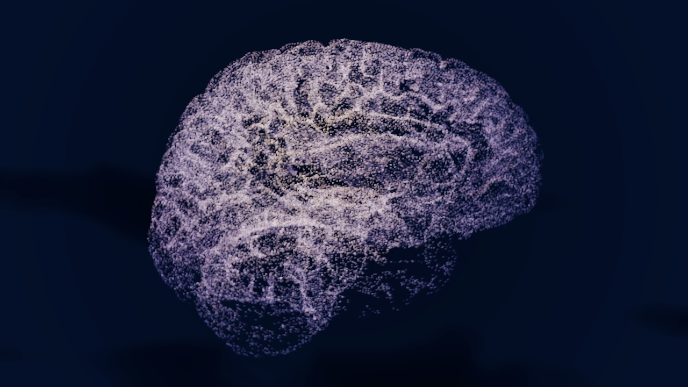

# Brain EEG Cloud

TD Factory's example project. A surface point-cloud brain that breathes, lights up in moving
focal points and can be turned with the mouse, driven by a simulated EEG signal. Six stages,
sixteen exposed parameters, 60 fps at 1280x720.



## Read in this order

| File | What it is |
|---|---|
| `spec.yaml` | **the contract**. Written by the Architect, mechanically validated, reviewed by a human before any build. Read this first. |
| `build-report.md` | what the Builder actually built, its measurements, the four rounds of human feedback, the deviations from the spec and the dead ends it documented. |
| `network/brain-eeg-cloud.tdxn` | the full network structure, as readable, diffable YAML. |
| `project1/fx_pulse/glsl_pulse_compute.glsl` | the shader: breathing, activity focus, normal-based lighting, back-face removal. |
| `project1/render/mouse_orbit.py` | mouse rotation, scoped to the render window. |
| `SURFACE-CLOUD-HOWTO.md` | why a solid cloud does not read, and how to produce a surface cloud with its normals. |

## The pipeline

| Stage | Role |
|---|---|
| `ctrl_signal` | the only entry point for the signal: three bands normalized to 0-1, mock or OSC, clamping here and nowhere else |
| `src_cloud` | load the surface cloud, add a random per-point seed, decimate |
| `bg_aurora` | animated background, bounded at the output so it can never come forward past the subject |
| `fx_pulse` | one GLSL POP: breathing, activity focus, colour, lighting, depth |
| `render` | additive sprites, camera, mouse rotation |
| `composite` | trails, composite over the background, glow, ACES tone map |

## Replaying this project

The `.toe` and the mesh are not versioned: the first is regenerable, the second is a
third-party model.

1. **Bring a brain mesh** (`.glb` with its normals) and convert it:

   ```bash
   python3 scripts/glb_to_ply.py --no-color --no-faces my_brain.glb assets/brain_surface.ply
   ```

   The converter applies the scene transforms, merges the objects, recenters and scales to a
   half-extent of 1.2, so every setting in the project stays valid.

2. **Rebuild the network**, either way:
   - from the contract: `/build-td-project brain-eeg-cloud`;
   - from the structure: copy `templates/seed.toe` to `project.toe`, open it, then import
     `network/brain-eeg-cloud.tdxn` into `/project1`.

## The control panel

`ui_control` shows the render as its background and the six stages' parameters in the top
right. It is not built from hand-made sliders: each section is a Parameter COMP scoped to its
stage's Custom page, so it follows any change to the parameters automatically.

The Perform window points at it: F1 gives the full-frame render with the controls on top.

## Still open

- The spec describes 14 parameters, the project exposes 16, and the source changed along the
  way: the contract deserves an Architect pass before the next build.
- The real EEG headset is not connected. `ctrl_signal` has its `Source` menu and its OSC branch
  ready; the mock stays active by default.
- 1280x720 is the effective ceiling of the Non-Commercial licence.
