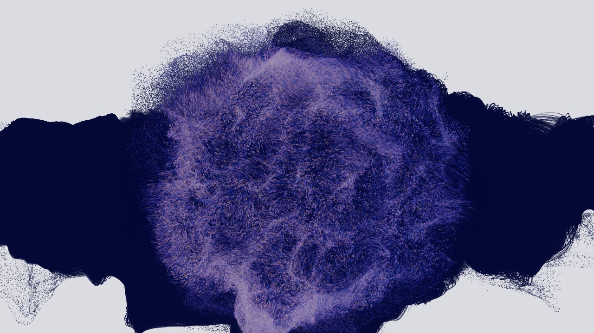

# Nebula Morph

The second example project. A GPU particle nebula morphing continuously between four
shapes -- sphere, torus, spiral galaxy, wave grid -- with luminous trails and a soft halo.
Fully autonomous: no input, driven by time and its nine parameters alone.

## Read in this order

| File | What it is |
|---|---|
| `spec.yaml` | the contract: six stages, nine parameters, seven acceptance criteria |
| `build-report.md` | what was built, the measurements, and what the Builder could not persist |
| `network/nebula-morph.tdxn` | the network structure, as readable YAML |
| `glsl/fx_morph_compute.glsl` | the compute shader holding the four shape functions |

## Why this one is in the repo

`brain-eeg-cloud` shows a project driven by an external signal, with an asset to load and
a long chain of human feedback. This one shows the opposite case: **no input at all**. The
piece drives itself from time, which makes the contract simpler and the acceptance
criteria different -- `morph_visible` instead of `signal_drives_image`.

Two contracts, two shapes of project, the same six-stage discipline.

## Rebuilding

The `.toe` is not versioned. Either replay the contract with
`/build-td-project nebula-morph`, or copy `templates/seed.toe` to `project.toe`, open it
and import `network/nebula-morph.tdxn` into `/project1`.
